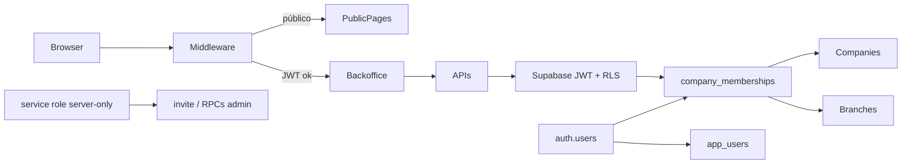

# Catering AI Platform — Fase 1: Segurança, Autenticação e Multiempresa

**Produto:** Catering AI Platform — BBQ AT HOME / CDL
**Tipo de documento:** Plano técnico detalhado (somente documentação)
**Versão:** V1
**Branch de referência:** `chore/bootstrap-catering-dev`
**Fonte da verdade de maturidade:** `docs/CATERING_AI_MATRIZ_MATURIDADE_V1.md`
**Escopo deste arquivo:** Planejamento da Fase 1 — sem implementação executável embutida

---

## Controles

- Modo: documentação somente.
- Não altera código-fonte, banco, migrations, SQL runtime, Supabase, Vercel, GitHub ou `.env.local`.
- Implementação depende de autorização explícita posterior, bloco a bloco.
- Referência de maturidade: Logistics AI / GRX — **sem** copiar frota, veículos, motoristas ou transporte.

---

## 1. Premissas oficiais

| Item | Estado na Matriz V1 |
|------|---------------------|
| Autenticação | **NÃO TEM** |
| Usuários e perfis | **PARCIAL** |
| Multiempresa | **PARCIAL** |
| Segurança e RLS | **PARCIAL** (risco crítico) |
| Clientes e contatos | **TEM** |
| Pacotes | **TEM** |
| Itens adicionais | **TEM** |
| Orçamentos | **TEM** |
| PDF do orçamento | **TEM** |
| Tenant atual | `company_id` / `branch_id` / `role` via env (`Lib/tenant/resolveTenant.ts`) |
| `middleware.ts` | Inexistente |
| `company_memberships` | Apenas em `scripts/sql/multi-tenant-foundation.sql` (sem fluxo app) |
| Client principal | Anon (`Lib/supabase.ts`); service role em `Lib/supabaseServer.ts` (server) |

**Regra de ouro da Fase 1:** nenhum módulo classificado como **TEM** poderá ser quebrado.

---

## 2. Decisões oficiais da Fase 1

1. `company_memberships.user_id` referencia `auth.users.id`.
2. `app_users.auth_user_id` será **UNIQUE** e vinculado a `auth.users.id`.
3. `pscs_master` é permissão **global da plataforma** e **não** role comum de empresa.
4. Migrations **não** terão UUIDs, e-mails ou usuários reais.
5. Seeds de roles **podem** ser versionados.
6. Membership do piloto CDL será criada em **script DEV separado** (não na migration canônica).
7. Nenhum `GRANT` ou policy `anon` será alterado no **F1.1**.
8. Nenhum módulo classificado como **TEM** poderá ser quebrado.

---

## 3. Perfis mínimos

| Perfil de negócio | Representação técnica | Escopo |
|-------------------|------------------------|--------|
| PSCS master | `app_users.is_pscs_master` (plataforma) | Todas as companies; não é role de `company_memberships` |
| Administrador da empresa | `admin` (e `owner` legado, se existir) | Uma company |
| Comercial | `sales` | Uma company |
| Operacional | `operator` | Uma company (+ `branch_id` opcional) |
| Financeiro | `finance` (novo no enum de produto) | Uma company |
| Somente leitura | `viewer` | Uma company |

Roles `manager` / `kitchen` podem permanecer no enum para compatibilidade; **não** são entrega mínima da Fase 1.

---

## 4. Modelo de identidade

```
auth.users (Supabase Auth)
    └── app_users
          - auth_user_id UNIQUE → auth.users.id
          - is_pscs_master (permissão global de plataforma)
          - display / active / metadados de perfil
            └── company_memberships
                  - user_id → auth.users.id
                  - company_id → companies.id
                  - branch_id? → branches.id
                  - role (admin, sales, operator, finance, viewer, …)
                  - active
                        ├── companies
                        ├── branches
                        └── app_roles (catálogo / seeds versionáveis)
```

---

## 5. Arquitetura proposta



**Princípios**

- Sessão via Supabase Auth (e-mail/senha) com cookies (`@supabase/ssr` previsto).
- Tenant (`company_id`, `branch_id`, role de empresa) resolvido pela sessão + membership — não por env em Preview/PROD.
- `pscs_master` opera como bypass de plataforma controlado e auditável.
- Service role apenas em código server-side pontual (invite, RPCs admin).
- Fechamento de `anon` ocorre em **F1.5**, nunca em F1.1.

---

## 6. Blocos da Fase 1

### F1.1 — Modelo de identidade e memberships

| Campo | Conteúdo |
|-------|----------|
| Status atual | `app_users` / `app_roles` no dump sem fluxo; `company_memberships` só no foundation SQL; sem vínculo Auth. |
| Gap vs Logistics AI | Logistics: Auth ↔ membership ↔ role. Aqui: tabelas órfãs + tenant por env. Sem frota. |
| Dependências | Projeto DEV Supabase; decisão de FK `user_id` / `auth_user_id` → `auth.users`. |
| Próximo passo mínimo | Spec + migration DEV de schema (sem seeds de pessoas): `company_memberships` canônica + `app_users.auth_user_id` UNIQUE + seed de roles versionável. Membership CDL só em script DEV separado. |
| Risco | Alto — schema errado bloqueia RLS e tenant. |
| Arquivos esperados | `supabase/migrations/YYYYMMDD_f1_identity_memberships.sql`; update `docs/architecture/multi-tenant.md`; ajuste de tipos em `Lib/tenant/types.ts` (`finance`; flag de plataforma para master). Script DEV separado para membership piloto. |
| Objetos de banco | `company_memberships` (criar/alinhar); `app_users.auth_user_id` UNIQUE → `auth.users`; `app_roles` seed versionado; índices `(user_id, active)`, `(company_id, user_id)`. **Sem** alteração de GRANT/policy anon neste bloco. |
| Ordem de implantação | **1º bloco de banco** (antes de UI Auth em PROD). |
| Estratégia de teste | SQL/integration em DEV: constraints, UNIQUE, FK Auth; seed de roles; script DEV de membership piloto isolado. |
| Estratégia de rollback | Reverter migration apenas em DEV se ainda sem dependentes; não tocar grants; script DEV de membership é descartável. |

**Cobertura:** identidade, memberships, relação Auth/`app_users`/`app_roles`/`companies`/`branches`, base para PSCS master.

---

### F1.2 — Auth e telas de acesso

| Campo | Conteúdo |
|-------|----------|
| Status atual | Sem `/login`, `/auth`, `signIn`, sessão, `@supabase/ssr`. |
| Gap vs Logistics AI | Login, logout, reset, cookie session. Sem frota. |
| Dependências | F1.1 (membership mínima para pós-login em DEV); Auth e-mail/senha; SMTP/reset Supabase. |
| Próximo passo mínimo | Rotas login + forgot/reset; cookie session; logout; redirect pós-login se membership ativa (ou `pscs_master`). |
| Risco | Alto — Auth sem membership deixa UX quebrada; misturar env Auth DEV/PROD. |
| Arquivos esperados | `app/login/page.tsx`; `app/auth/forgot-password/page.tsx`; `app/auth/reset-password/page.tsx`; `app/auth/callback/route.ts`; `Lib/supabase/browser.ts`, `Lib/supabase/server.ts`, `Lib/supabase/middleware.ts`; `components/auth/*`; dependência `@supabase/ssr`. |
| Objetos de banco | `auth.users` (managed); trigger opcional `on_auth_user_created → app_users` (sem dados reais na migration). |
| Ordem de implantação | Após F1.1 em DEV; **antes** de fechar anon. |
| Estratégia de teste | Unit: helpers de sessão; E2E DEV: login/logout/reset; sessão persiste após refresh. |
| Estratégia de rollback | Remover/desligar rotas Auth; app permanece utilizável até F1.5 (anon ainda aberto). |

**Fluxos**

1. Login e-mail/senha → sessão cookie → resolve membership ou `pscs_master` → tenant.
2. Forgot → e-mail Supabase → reset → login.
3. Logout → clear session → `/login`.

**Cobertura:** Auth e-mail/senha; recuperação/redefinição; login/logout/persistência de sessão; início do convite (completo em F1.6).

---

### F1.3 — Middleware e proteção de rotas

| Campo | Conteúdo |
|-------|----------|
| Status atual | Sem `middleware.ts`; backoffice aberto. |
| Gap vs Logistics AI | Gate de rotas + redirect login. Sem frota. |
| Dependências | F1.2 (sessão cookie). |
| Próximo passo mínimo | `middleware.ts` com matcher; privadas exigem JWT; públicas liberadas. |
| Risco | Crítico se API continuar aberta — mitigar com F1.5 + proteção de APIs. |
| Arquivos esperados | `middleware.ts`; `Lib/auth/routePolicy.ts`; testes do matcher. |
| Objetos de banco | Nenhum. |
| Ordem de implantação | Imediatamente após F1.2. |
| Estratégia de teste | E2E: anônimo → redirect; autenticado → acesso; rotas públicas intactas. |
| Estratégia de rollback | Desabilitar matcher / remover middleware; rotas voltam abertas. |

#### Rotas públicas (Fase 1)

| Rota | Motivo |
|------|--------|
| `/` | Landing |
| `/login`, `/auth/*`, `/auth/callback` | Acesso |
| `/customer-quote` | Educativo estático |
| `/quote-request` | Stub portal (sem dados sensíveis; reavaliar após RLS) |
| `/_next/*`, assets `public/*` | Runtime |

#### Rotas privadas (backoffice)

| Rota |
|------|
| `/quotes`, `/quotes/new`, `/quotes/[id]`, `/quotes/[id]/edit` |
| `/customers` |
| `/packages`, `/packages/images` |
| `/additional-items` |
| `/commercial-rules` |
| Futuro Fase 1: `/users`, `/settings` |

#### APIs

| Classe | Regra Fase 1 |
|--------|----------------|
| Privadas | JWT obrigatório: quotes, customers, packages*, additional-items*, commercial-rules*, tenant/context |
| Auth | callback / session refresh |
| Público controlado | Somente endpoint público explícito futuro — **não** no MVP F1 |

**Cobertura:** middleware; lista pública/privada; proteção de APIs (camada rota).

---

### F1.4 — Tenant por sessão

| Campo | Conteúdo |
|-------|----------|
| Status atual | Env / `CDL_DEFAULT_COMPANY_ID`; branch em `localStorage`; role via env. |
| Gap vs Logistics AI | Tenant da membership autenticada. Sem frota. |
| Dependências | F1.1 + F1.2; membership ativa (script DEV CDL) ou `pscs_master`. |
| Próximo passo mínimo | `resolveTenantFromSession()`; `company_id` da membership; `branch_id` da membership ou branch permitida; env deixa de ser fonte primária em Preview/PROD. |
| Risco | Alto — quebra piloto CDL se membership DEV não existir. |
| Arquivos esperados | Refactor `Lib/tenant/resolveTenant.ts`, `fetchTenantContext.ts`, `queryScope.ts`, `TenantProvider.tsx`, `app/api/tenant/context/route.ts`; seletor de company para `pscs_master`. |
| Objetos de banco | Leitura `company_memberships`, `companies`, `branches`, `app_users.is_pscs_master`. |
| Ordem de implantação | Após F1.2/F1.3; **antes** de RLS restritiva. |
| Estratégia de teste | Integration: user A company X não resolve Y; branch só da company; `pscs_master` pode trocar company. |
| Estratégia de rollback | Flag `TENANT_FROM_SESSION=false` → fallback env **somente DEV/emergência**. |

**Regras**

- `company_id` = membership ativa (ou selecionada se várias; `pscs_master`: seletor).
- `branch_id` = `membership.branch_id` **ou** escolha na UI **se** branch ∈ company.
- Env `NEXT_PUBLIC_CDL_*` → bootstrap/dev fallback documentado; **não** autoridade em Preview/PROD.

**Cobertura:** resolução `company_id` / `branch_id`; substituição do tenant por env; estratégia PSCS master.

---

### F1.5 — RLS e fechamento do anon

| Campo | Conteúdo |
|-------|----------|
| Status atual | RLS on + `GRANT ALL TO anon` + policies `USING (true)`; mutações via anon. |
| Gap vs Logistics AI | RLS por membership; anon sem escrita comercial. Sem frota. |
| Dependências | F1.1–F1.4 estáveis em DEV; clients JWT no server/browser autenticado. |
| Próximo passo mínimo | Em **DEV**: policies por membership; revoke writes anon; app 100% autenticado; depois Preview → PROD. |
| Risco | **Crítico** — fechar cedo derruba TEM; fechar tarde mantém vazamento. |
| Arquivos esperados | `supabase/migrations/YYYYMMDD_f1_rls_lockdown.sql`; ajuste `Lib/supabaseServer.ts` (JWT user por default); APIs com server client autenticado; checklist de revoke. |
| Objetos de banco | Policies `company_id IN (SELECT … FROM company_memberships WHERE user_id = auth.uid() AND active)`; bypass controlado `pscs_master`; `REVOKE` anon nas core; drop `USING (true)` comerciais; Storage alinhado. |
| Ordem de implantação | **Último gate de segurança** antes de Preview “fechado”. |
| Estratégia de teste | Integration: anon SELECT/INSERT falha; authenticated membership OK; cross-tenant deny; PDF/upload OK; fluxos TEM E2E. |
| Estratégia de rollback | Script reabre grants **somente DEV**; PROD: hotfix policy + incident; nunca `GRANT ALL anon` como padrão permanente. |

**Tabelas core prioritárias:** `customers`, `quotes` (+ filhos), `events`, `packages` (+ filhos), `catalog_items`, `commercial_rules`, `companies`, `branches`, `app_users`, `company_memberships`, `audit_logs`, buckets Storage.

**Mutações críticas:** create/update/delete de quotes, customers, packages/config, additional-items, commercial-rules, images, PDF — via Route Handler com JWT **ou** RLS + client autenticado.
**Service role:** somente server-side pontual (ex.: numeração de documento, admin invite).

**Cobertura:** RLS por membership; remoção segura de `GRANT ALL` anon e `USING (true)`; mutações críticas; service role server-only; proteção de APIs (camada dados).

---

### F1.6 — Usuários e perfis

| Campo | Conteúdo |
|-------|----------|
| Status atual | Sem UI de usuários; role por env. |
| Gap vs Logistics AI | Admin convida, role, ativa/desativa. Sem frota. |
| Dependências | F1.1–F1.5; service role server-only para invite Auth. |
| Próximo passo mínimo | `/users`: listar memberships; convidar e-mail+role; ativar/desativar; `pscs_master` gerencia cross-company. |
| Risco | Alto — invite com service role mal exposto. |
| Arquivos esperados | `app/users/page.tsx`; `app/api/users/*`; `Lib/users/inviteUser.ts`; gates em `Lib/tenant/roles.ts`. |
| Objetos de banco | `company_memberships`, `app_users`; opcional `user_invites` (token, email, role, expires_at) — sem dados reais na migration. |
| Ordem de implantação | Após RLS (ou paralelo em DEV com policies de membership). |
| Estratégia de teste | E2E: admin convida → aceita → login → tenant certo; viewer sem mutação UI. |
| Estratégia de rollback | Desligar rota `/users`; memberships manuais apenas via script DEV. |

**Convite e ativação**

1. Admin/`pscs_master` cria invite → Auth invite/magic ou senha temporária.
2. User define senha → `app_users` + membership `active`.
3. Sem membership ativa e sem `pscs_master` → tela “sem acesso” (não entra no backoffice).

**Cobertura:** perfis mínimos; convite/ativação; PSCS master operacional.

---

### F1.7 — Auditoria mínima

| Campo | Conteúdo |
|-------|----------|
| Status atual | `audit_logs` sem uso no app TS; soft-delete de quotes. |
| Gap vs Logistics AI | Trilha quem/quando/o quê. Sem frota. |
| Dependências | Auth (`user_id`) + `company_id` da sessão. |
| Próximo passo mínimo | Gravar `audit_logs` em create/update/delete de `quotes` (+ opcional customers). |
| Risco | Médio — volume/PII em `old_data`/`new_data`. |
| Arquivos esperados | `Lib/audit/writeAuditLog.ts`; hooks em create/update quote e APIs. |
| Objetos de banco | `audit_logs`; RLS insert authenticated + select admin/`pscs_master`. |
| Ordem de implantação | Após F1.4; pode paralelizar com F1.6. |
| Estratégia de teste | Integration: mutação quote → 1 row audit com `auth.uid()`. |
| Estratégia de rollback | Writer no-op; tabela permanece. |

---

### F1.8 — Testes e preparação Preview

| Campo | Conteúdo |
|-------|----------|
| Status atual | Separação PROD/DEV **PARCIAL**; pasta `supabase/migrations/` ausente na Matriz V1; sem suite Auth. |
| Gap vs Logistics AI | Pipeline de ambientes + testes gate. Sem frota. |
| Dependências | F1.1–F1.7 verdes em DEV. |
| Próximo passo mínimo | Checklist DEV → Preview → PROD; seeds de roles; E2E smoke Auth + CRUD TEM. |
| Risco | Alto — misturar refs/keys; fechar RLS em PROD sem Preview. |
| Arquivos esperados | Runbooks/docs de promoção; testes unit/integration/E2E; job CI opcional. |
| Objetos de banco | Mesmo schema DEV→PROD via migrations versionadas (sem UUIDs/e-mails/usuários reais nas migrations). |
| Ordem de implantação | Último bloco da Fase 1. |
| Estratégia de teste | Ver matriz de testes abaixo. |
| Estratégia de rollback | Reverter deploy Preview; PROD: restore policy controlado + redeploy anterior. |

#### Matriz de testes

| Tipo | Escopo |
|------|--------|
| Unit | Roles/permissions; `routePolicy`; resolve de tenant puro |
| Integration | Membership RLS; API 401 sem JWT; cross-tenant negado |
| E2E | Login/logout/reset; CRUD autenticado de clientes, pacotes, itens, orçamentos + PDF; upload de imagens |

**Cobertura:** processo DEV→Preview→PROD; testes; critérios de aceite; validação de impacto TEM.

---

## 7. Objetos de banco (visão consolidada)

| Objeto | Ação na Fase 1 |
|--------|----------------|
| `auth.users` | Usar (Supabase Auth) |
| `app_users` | Estender com `auth_user_id` UNIQUE → `auth.users.id`; `is_pscs_master` |
| `app_roles` | Seed versionável dos perfis mínimos de empresa |
| `company_memberships` | Criar/alinhar; `user_id` → `auth.users.id`; RLS em F1.5 |
| `companies` / `branches` | RLS de leitura por membership (F1.5) |
| `audit_logs` | Uso pelo app + RLS (F1.7 / F1.5) |
| Policies / grants core + Storage | Fechar anon e `USING (true)` **somente a partir de F1.5** |
| Opcional `user_invites` | Convite (F1.6); sem dados reais na migration |
| Script DEV separado | Membership piloto CDL (não na migration canônica) |

**Proibições de migration**

- Sem UUIDs de empresas/usuários reais.
- Sem e-mails reais.
- Sem usuários reais.
- Sem alteração de GRANT/policy anon no F1.1.

---

## 8. Arquivos e rotas afetados (visão consolidada)

### Novos (esperados)

- `middleware.ts`
- `app/login/**`
- `app/auth/**` (forgot, reset, callback)
- `app/users/**`
- `Lib/supabase/browser.ts`, `Lib/supabase/server.ts`, `Lib/supabase/middleware.ts`
- `Lib/auth/**`
- `Lib/audit/**`
- `Lib/users/**`
- `supabase/migrations/*` (quando autorizado a implementar)
- Script DEV separado de membership piloto CDL

### Refactor (esperados)

- `Lib/tenant/*` (`resolveTenant`, `fetchTenantContext`, `queryScope`, `roles`, `types`)
- `Lib/supabase.ts` / `Lib/supabaseServer.ts`
- `components/tenant/TenantProvider.tsx`, `TenantContextBar.tsx`
- APIs em `app/api/**` (quotes, customers, packages, additional-items, commercial-rules, tenant)
- Libs de quotes, customers, packages, images, PDF

### Rotas

- Públicas e privadas conforme F1.3.
- APIs de backoffice com JWT obrigatório após F1.3/F1.5.

---

## 9. Processo DEV → Preview → PROD

1. **DEV** — aplicar migrations de schema + Auth + seed de roles + script DEV de membership CDL; testes locais.
2. **Preview (Vercel)** — env apontando para Supabase **DEV** (ou DB Preview dedicado); Auth redirect URLs do Preview; smoke autenticado dos fluxos TEM.
3. **PROD** — migrations canônicas (sem dados reais); Auth URLs de produção; **sem** service role no client; smoke com usuário real operacional (fora da migration).
4. Nunca usar PROD como playground de RLS/Auth.
5. Fechamento de grants/policies anon: DEV → Preview → PROD, nunca o inverso.

---

## 10. Riscos críticos

1. Fechar anon antes do app autenticado → outage dos módulos TEM.
2. Service role no browser ou em API pública.
3. Mistura de refs/keys DEV/PROD.
4. Membership ausente no piloto CDL (script DEV não executado).
5. Policies `USING (true)` remanescentes após F1.5.
6. `pscs_master` mal modelado como role de empresa (violaria decisão oficial).
7. Migration com UUIDs/e-mails/usuários reais (violaria decisão oficial).
8. Alterar GRANT/policy anon no F1.1 (violaria decisão oficial).

---

## 11. Plano de rollback

| Estágio | Ação |
|---------|------|
| Pré-F1.5 | Reverter PR/deploy; Auth pode permanecer opcional |
| F1.1 apenas | Reverter migration de schema em DEV; script DEV de membership descartável; grants intactos |
| Pós-F1.5 DEV | Script de restore de grants **somente DEV** |
| Preview | Redeploy anterior + env DEV |
| PROD | (1) redeploy anterior (2) hotfix de policy (3) reopen controlado de anon **somente** em incidente documentado — nunca como padrão |

---

## 12. Critérios de aceite

1. Login / logout / reset com e-mail e senha funcionais.
2. Sessão persiste após refresh.
3. Backoffice privado; rotas públicas listadas intactas.
4. `company_id` / `branch_id` / role de empresa vêm da sessão/membership (não de env em Preview/PROD).
5. `pscs_master` é permissão global de plataforma, não role comum de `company_memberships`.
6. Anon sem `GRANT ALL` / write nas core e sem `USING (true)` comercial **após F1.5**.
7. Mutações críticas com JWT ou server autenticado; service role só server-side.
8. APIs de backoffice retornam 401 sem sessão.
9. Perfis mínimos operacionais + convite/ativação.
10. `audit_logs` em mutações de quote.
11. Fluxos TEM (clientes, pacotes, itens adicionais, orçamentos, PDF, imagens) passam E2E autenticados.
12. Migrations sem UUIDs, e-mails ou usuários reais; membership CDL só via script DEV.
13. F1.1 não altera grants/policies anon.
14. Promoção somente DEV → Preview → PROD com checklist.

---

## 13. Impacto nos módulos TEM

| Fluxo TEM | Impacto da Fase 1 | Mitigação |
|-----------|-------------------|-----------|
| Clientes e contatos | APIs passam a exigir JWT; RLS por `company_id` (F1.5) | Seed/script DEV membership CDL; E2E CRUD |
| Pacotes | Idem + Storage policies (F1.5) | Upload só autenticado; smoke Preview |
| Itens adicionais | Idem | Mesmo padrão de packages |
| Orçamentos | Maior superfície (wizard + APIs + events) | Migrar clients para sessão; testar wizard completo |
| PDF do orçamento | Rota PDF autenticada | Download apenas logado |
| Imagens / Storage | Buckets fecham write anon (F1.5) | Policies `authenticated` + escopo company |

**Regra:** nenhum fluxo TEM pode ser fechado em PROD antes do smoke Preview autenticado.

---

## 14. Sequência de implantação

1. **F1.1** Modelo identity/memberships (DEV) — sem tocar anon
2. **F1.2** Auth UI + sessão
3. **F1.3** Middleware e proteção de rotas
4. **F1.4** Tenant por sessão (+ script DEV membership CDL)
5. **F1.5** RLS + revoke anon (DEV → Preview → PROD)
6. **F1.6** Usuários / convite / perfis
7. **F1.7** Auditoria mínima de quotes
8. **F1.8** Testes e preparação Preview/PROD

---

## 15. Primeiro bloco mínimo recomendado

**F1.1 em DEV apenas**

- Modelo `app_users.auth_user_id` UNIQUE → `auth.users`
- `company_memberships.user_id` → `auth.users`
- `app_roles` seed versionável
- `is_pscs_master` como permissão global de plataforma
- Membership piloto CDL **somente** em script DEV separado
- **Não** alterar GRANT/policy anon
- **Não** quebrar módulos TEM
- Migration **sem** UUIDs, e-mails ou usuários reais

---

## 16. Fora de escopo da Fase 1

- Ordem de serviço, agenda operacional, estoque, financeiro completo, dashboard gerencial.
- Portal do cliente e recursos de IA.
- Qualquer módulo de frota, veículos, motoristas ou transporte.
- Fechamento de anon antes de F1.5.
- Dados reais embutidos em migrations.

---

*Fim do plano técnico — Fase 1 Segurança, Autenticação e Multiempresa.*
*Documento de planejamento. Aguarda autorização para implementação.*
